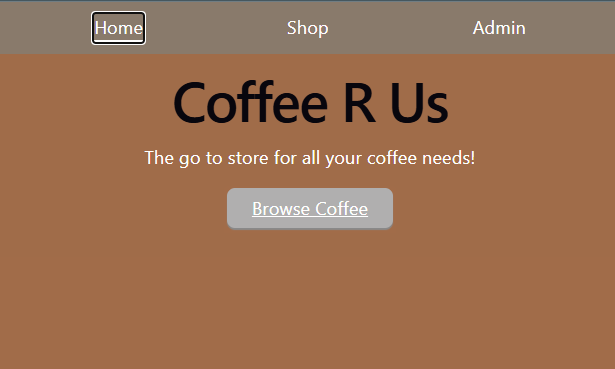
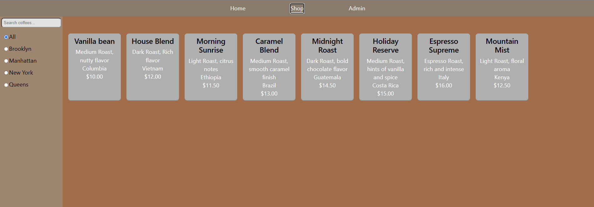
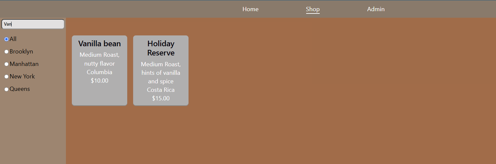
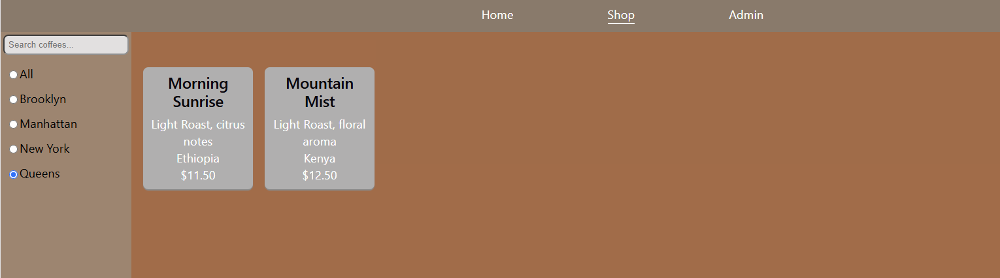
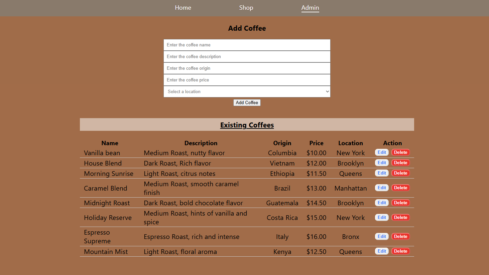
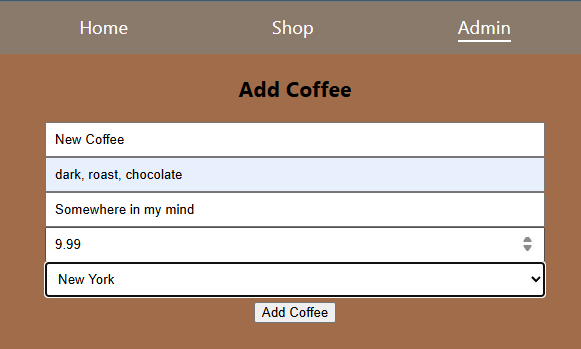
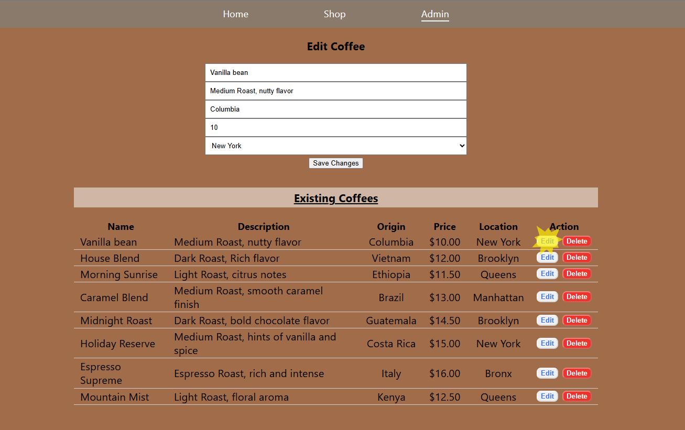
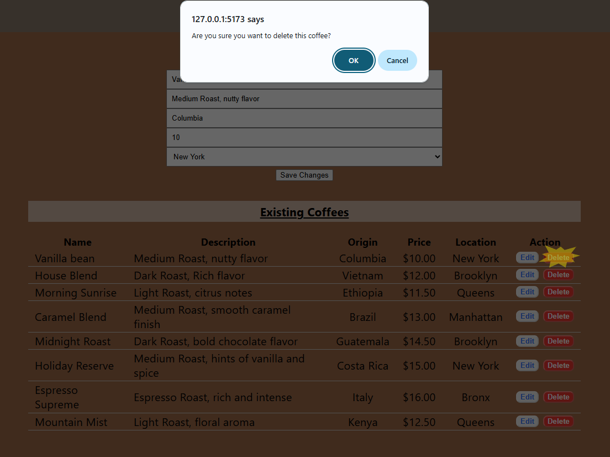

# Coffee R Us

Coffee R Us is a React single-page application that allows users to browse a coffee inventory, search and filter available coffees, and manage inventory through an administrative portal.

## Features

### Home Page
- Displays a welcome message and application branding.
- Provides navigation to the coffee shop catalog.

### Shop Page
- Displays all available coffees.
- Search coffees by:
  - Name
  - Description
  - Origin
- Filter coffees by location:
  - All
  - Brooklyn
  - Manhattan
  - New York
  - Queens

### Admin Portal
- View all existing coffees.
- Add new coffees.
- Edit existing coffees.
- Delete coffees with confirmation.

---

## Technologies Used

- React
- React Router
- JavaScript (ES6+)
- CSS
- JSON Server
- Vitest
- React Testing Library

---

## Project Structure

```text
src/
├── components/
│   ├── CoffeeCard.jsx
│   ├── NavBar.jsx
│   ├── SearchBar.jsx
│   └── SideBarFilter.jsx
│
├── pages/
│   ├── HomePage.jsx
│   ├── ShopPage.jsx
│   └── AdminPortal.jsx
│
├── tests/
│   ├── HomePage.test.jsx
│   ├── ShopPage.test.jsx
│   └── AdminPortal.test.jsx
│
├── App.jsx
└── main.jsx
```

---

## Screenshots

### Home Page



Displays the landing page and navigation to the coffee catalog.

### Shop Page



Users can browse, search, and filter coffees by location.

### Search Functionality



Coffee inventory updates dynamically as users search by name, description, or origin.

### Location Filter



Users can filter available coffees by store location.

### Admin Portal



Administrators can add, edit, and delete coffee inventory.

### Add Coffee Form



Form used to create new coffee entries.

### Edit Coffee



Existing coffee information can be updated through the admin interface.

### Delete Coffee



Existing coffee information can be deleted through the admin interface.

---

## Installation

Clone the repository:

```bash
git clone <repository-url>
```

Navigate into the project directory:

```bash
cd coffee-r-us
```

Install dependencies:

```bash
npm install
```

---

## Running the Application

Start the React development server:

```bash
npm run dev
```

Start the JSON Server:

```bash
npx json-server --watch db.json --port 3001
```

The application will be available at:

```text
http://localhost:5173
```

The API will be available at:

```text
http://localhost:3001
```

---

## Testing

Run all tests:

```bash
npm test
```

Run Vitest in watch mode:

```bash
npm run test
```

Run test coverage:

```bash
npm run coverage
```

### Test Coverage

The test suite validates:

#### Home Page
- Homepage content renders correctly.
- Navigation link routes users to the shop page.

#### Shop Page
- Coffee cards render correctly.
- Search functionality works by:
  - Name
  - Description
  - Origin
- Location filtering updates displayed coffees.

#### Admin Portal
- Form and table render correctly.
- New coffees can be added.
- Existing coffees can be edited.
- Coffees can be deleted.
- Delete cancellation prevents removal.

---

## API Endpoints

### Coffees

```http
GET    /coffee
POST   /coffee
PATCH  /coffee/:id
DELETE /coffee/:id
```

### Locations

```http
GET /locations
```

---

## Future Improvements

- Form validation and error handling.
- Dynamic location management.
- Coffee image support.
- User authentication for the Admin Portal.
- Responsive mobile layout enhancements.

---

## Author

Created by Matthew Swanberg as part of a React and Testing Summative Lab (course 5 mod 8)